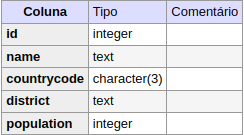
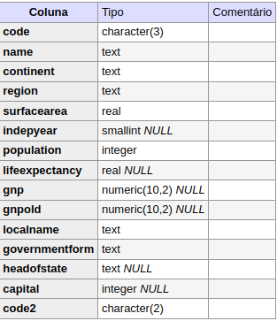
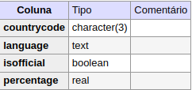

# Overview 

The current project consists in ETL using logstash as data transfer and postgres as data source with opensearch container as data target.

<hr>

## Load data in postgres


```shell
    $ make db_restore_backup
```

The command above will load the next tables in postgres database:

**City Table**



**Country Table**



**Country Language Table**


