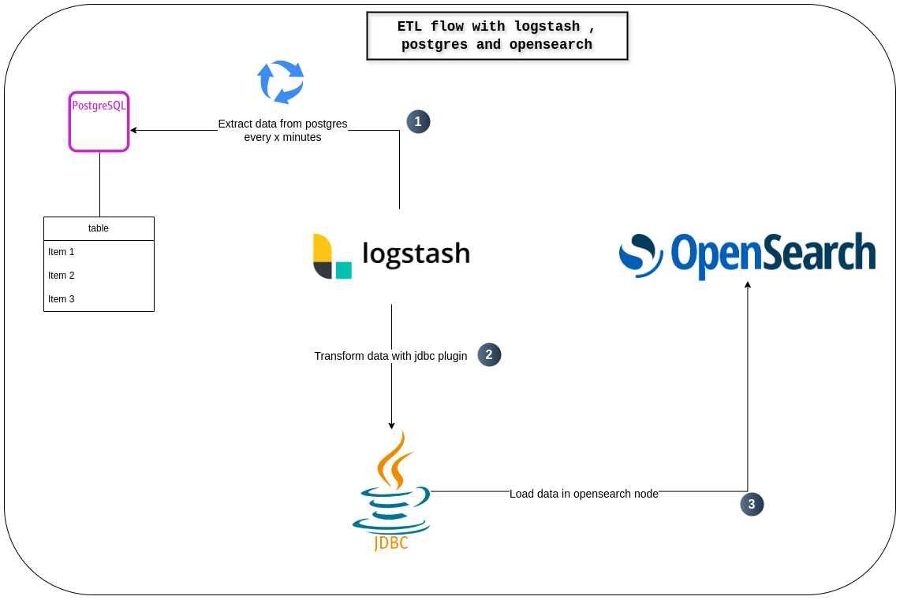

# Overview 

The current project consists in ETL using logstash as data transfer and postgres as data source with opensearch container as data target.



<hr>

## General prerequisite

- Docker and docker-compose
- Make tool


## Starting postgres container

```shell
    $ make db_up
```

This command starts postgres instance inside 'db' container.

## Starting Opensearch Node

```shell
    $ make opensearch_up
```

Executed the command above we can access opensearch resources :

- **Dashboard** in https://localhost:5601

- **API** in https://localhost:9200

(credentials access are stored in .env)

## Load data in postgres


prerequisite: Start postgres instance

```shell
    $ make db_restore_backup
```

The command above will load the next tables in postgres database:

**City Table**


**Country Table**


**Country Language Table**


